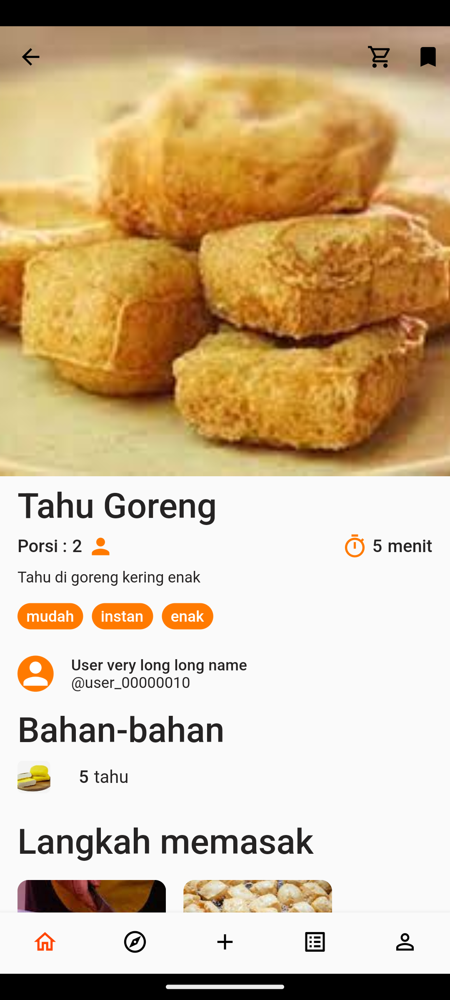

# Recipee

Sometimes cooking can be challenging, but with Recipee, your culinary journey becomes a delightful adventure. Recipee is not just a platform or application; it's your ultimate companion in the kitchen. Discover an extensive collection of cooking guides and recipes, effortlessly share your culinary creations, and conveniently procure all the essential ingredients in just a few clicks.

## In-App Screenshots

### Recipe
 &nbsp;  &nbsp; 

### Purchase Ingredients
 &nbsp;  &nbsp; 

### And more
 &nbsp;  &nbsp;  &nbsp; 

## Stack & Libs
- [Flutter](https://flutter.dev/) 
- [Ruby on Rails](https://rubyonrails.org/)
- [PostgreSQL](https://www.postgresql.org/)
- [Bloc](https://bloclibrary.dev/#/) state management.
- [Dio](https://pub.dev/packages/dio) for communicating with the APIs.
- [Freezed](https://pub.dev/packages/freezed) for faster development (generator to remove boiler plate code).
- [Open Street Map](https://www.openstreetmap.org) to illustrate the map.
- [Geolocator](https://pub.dev/packages/geolocator) get users location.
- [Geo Coding](https://pub.dev/packages/geocoding) translate coordinate(lat,long) to an actual address.
- [Webview](https://pub.dev/packages/webview_flutter) to open in-app web
- [Easy Localization](https://pub.dev/packages/easy_localization) help building localization/internationalization for the app
- [Staggred Grid View](https://pub.dev/packages/flutter_staggered_grid_view) for better lists view
- [Mockito](https://pub.dev/packages/mockito) to help testing (mock classes and data)
- [Rspec](https://github.com/rspec/rspec-rails) testing framwork for rails app
- [Factory Bot](https://github.com/thoughtbot/factory_bot_rails) to help testing (mock classes and data)
